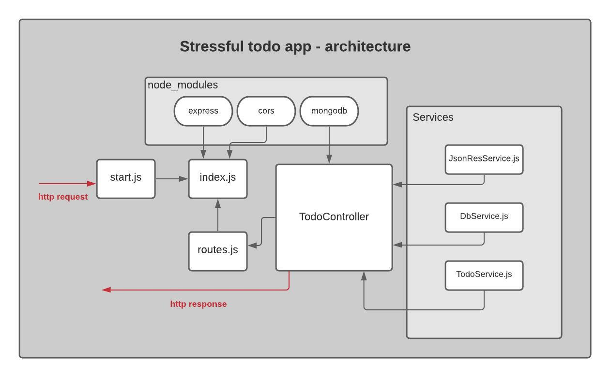

# A Stressful Christmas Todo app
An exercise to practice using Node.js and MongoDB with the Controller-Services pattern and Express for routing.

### App architecture:



### Documentation (WIP!)
##### Return all tasks
- URL:
  - `/` (for uncompleted) 
  - `/completed` (for completed)
- Method: `GET`
- URL Params required: None
- Data Params: None
- Success Response: 
  - Code: 200. 
  - Content: ```"data": [
    {
    "_id": "61a62debb3f2deaf11219237",
    "description": "Chop down a Christmas tree",
    "completed": false
    },
    {
    "_id": "61a8f9701dbfd4dc3f566014",
    "description": "Deck the halls",
    "completed": false
    },
    ]```

##### Add a task
- URL: `/add` 
- Method: `POST`
- URL Params required: None
- Data Params: `req.body.description`

##### Complete a task
- URL: `/done:id`
- Method: `PUT`
- URL Params required: `id=[string]`
- Data Params:

##### Add a tag
- URL: `/tags`
- Method: `PUT`
- URL Params required:
- Data Params: `req.body.id`, `req.body.tags`

##### Delete a task
- URL: `/delete/:id`
- Method: `DELETE`
- URL Params required: `id=[string]`
- Data Params: 